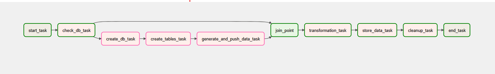
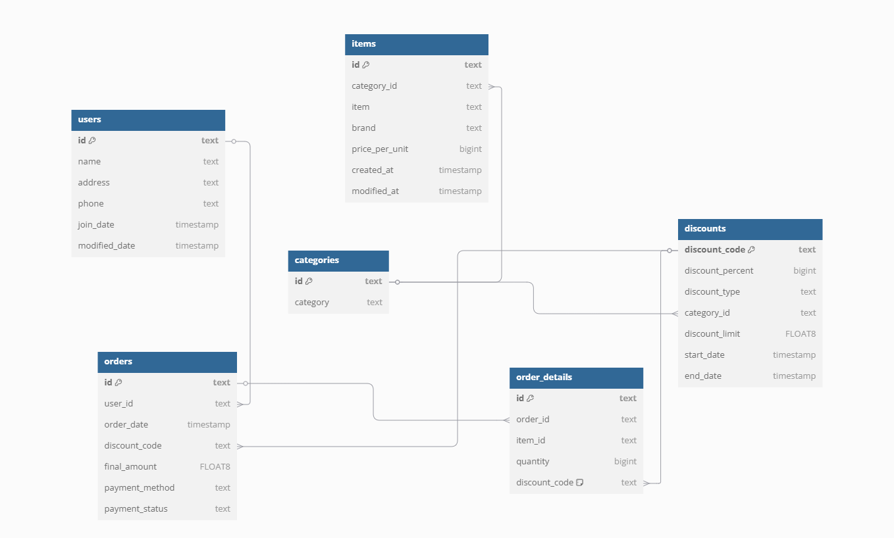

#retail-data-etl-project
An ETL pipeline for a fake retail store.
/
What this project does: 
1: Defines an ETL pipeline to store(in RDS), retreive, transform and store(in S3) retail data(pipeline dag can be found below). /
2: Creates a database with relevant tables(schema can be found below) if the database does not exist. /
3: Generates random fake data to populate the tables. /
4: Pushes the data to the database. /
5: Transforms data based on user requirements. /
6: Stores transformed data in cloud. /
/
What this project uses: /
1: Airflow to orchestrate the ETL pipeline. /
2: Python as programming language for logic implemntation. /
3: AWS RDS for database management. /
4: AWS S3 as data lake for transformed data. /
5: Faker(package) to generate random/fake data. /
6: psycopg2(PostgreSQL package) to connect to RDS database and perform SQL operations. /
7: Boto3 to connect to S3 bucket for storing transformed datasets. /

/
Pipeline DAG: 

/
Database schema: 

Custom transformations: 
The best feature of this pipeline is to be able to create your own custom dataset without having to modify the code!
All one would have to do is write a sql query to query what they'd want and place it inside /customScripts/sqlScripts with '.txt' extension and the the transformed csv will be available in the users S3 bucket once the pipeline is run.
/
Data generation: /
This project is also capable of generating fake data to be pushed into the RDS for experimentation. /
This step is required initially as there is no data present at the start. /
One can generate n users, n discounts, and n orders. /
To modify, please go to the generate_and_push_data_to_rds() in /dags/etl-pipeline.py and modify the numbers. /